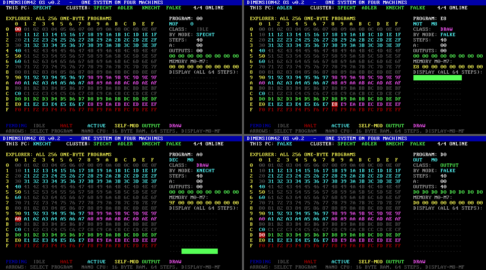

# Dimension42

**Every one of 1.1 trillion five-byte programs, explored on a tiny virtual CPU.**

Dimension42 combines a handwritten x86 OS, exhaustive NANO program search, and neural program generation.
What can five bytes compute, and can a small model learn to write those programs?

**1,099,511,627,776 programs mapped · 84,933 singleton behavior signatures · approximately 86–93% neural transfer on unseen three-input cell layouts.**

Those numbers measure different experiments. Singleton signatures use 16 input probes; **83,802 of their programs self-modify** on at least one probe. The transfer experiment holds out layouts, not all program identities.

[Try the CPU demo](#quickstart-no-gpu) · [Explore the byte tricks](#five-bytes-that-rewrite-themselves) · [Reproduce the neural experiment](#reproduce-the-three-input-neural-experiment) · [Results](explorer/README.md)

## Results at a glance

| Experiment | Result | Evidence and scope |
|---|---|---|
| Five-byte map | **All 2^40 programs**, 1,024 compressed chunks; recorded time **159.65 s** | [Manifest](explorer/results/L5/manifest.json). At most 64 instructions from the standard zero-initialized state; six broad classes. |
| Input/output catalog | **219,846 signatures**, including **84,933 with exactly one program** | [Catalog](explorer/results/catalog/catalog.txt). Hashes of first outputs on 16 fixed input pairs; programs must answer every probe with nonconstant outputs. |
| Self-modifying singletons | **83,802 / 84,933 = 98.67%** | A changed code byte before the first output on at least one catalog probe. Not every singleton self-modifies. |
| Three-input neural transfer | **85.75–93.15%**, approximately **86–93%** | [Saved results](explorer/ai/results_three.json): 2,000 candidates per layout; successful programs checked on all **16,777,216** byte triples. |

The map verification recounted all 1,024 files and recomputed 16 chunks on the other GPU family. Publication also checked every compressed five-byte chunk against its saved SHA-256. These checks establish agreement, not a formal proof of the simulator.

Recount the catalog and singleton self-modification figures with `python tools/audit_catalog.py` (CPU only).

### What the neural result means

| Held-out layout | Correct generated programs | Success rate |
|---|---:|---:|
| M5, M6, M8 | 1,735 / 2,000 | 86.75% |
| M5, M7, M9 | 1,863 / 2,000 | 93.15% |
| M6, M7, M8 | 1,715 / 2,000 | 85.75% |
| M6, M8, M9 | 1,781 / 2,000 | 89.05% |

Experiment B trains on two-input adders plus three-input adders for six layouts, then tests four different three-input layouts. **All successful program identities were already in training under other tasks.** This measures transfer to unseen layout prompts, not invention of unseen programs. Rates include repeated sampled candidates and come from one recorded run, not an average across seeds.

### Programming by Example is a separate experiment

[`pbe.py`](explorer/ai/pbe.py) samples random programs and executes them live to make examples. [`pbe2.py`](explorer/ai/pbe2.py) and [`pbe3.py`](explorer/ai/pbe3.py) instead sample catalog signatures uniformly, then execute representatives on eight fresh input pairs per training item. The model predicts five bytes from examples using supervised cross-entropy training. Ten target-function probe signatures are withheld; candidate solutions are checked on all 65,536 pairs.

**The 86–93% figure does not describe PBE generalization.** The published two-hour PBE run has much weaker results; see its [evaluation history](explorer/ai/pbe2_results.json). Matching 16 probes or reducing token loss does not establish full functional correctness.

## Five bytes that rewrite themselves

NANO has 16 bytes of shared code/data memory and an 8-bit accumulator A. Each instruction has an operation nibble and an argument nibble. Arithmetic wraps modulo 256; instruction fetch and jumps wrap at program length. These examples start with A = 0, inputs in the named cells, and other non-code memory zero. The answer is the **first OUT within 64 steps**.

### `17 C5 91 50 71`: a XOR b XOR 7

Inputs: a in M5, b in M6.

| Byte | Instruction | Role |
|---|---|---|
| `17` | LDI 7 | Start A at 7. |
| `C5` | XOR M5 | XOR in a; this instruction changes on later passes. |
| `91` | INC M1 | Change `C5→C6→C7→…→CF→D0`. |
| `50` | ST M0 | Store the result over the initial LDI instruction. |
| `71` | JMP 1 | Loop without executing overwritten M0. |

The second pass XORs in b. Reads of M7–MF then XOR zero, preserving the result. Incrementing `CF` produces `D0`: **the XOR becomes OUT M0**. At step 46 it emits `a XOR b XOR 7`. The CPU demo verifies all 65,536 input pairs with the Python reference.

### `67 A0 5C E2`: a three-input adder in four bytes

Inputs: a in M5, b in M6, c in M7. Initial instructions: ADD M7, DEC M0, ST MC, NOT M2.

| Pass | What changes |
|---|---|
| 1 | Add c. M0 changes `67→66` (ADD M6). NOT M2 changes `5C→A3` (DEC M3). |
| 2 | Add b. M0 becomes `65` (ADD M5). M3 changes `E2→E1`; executing E1 changes M1 `A0→5F` (ST MF). |
| 3 | Add a; save the sum in MF. M3 becomes E0, which changes M0 `65→9A` (INC MA). |
| 4 | Increment an unrelated cell; save the unchanged sum. M3 becomes DF (OUT MF), emitting the sum at step 16. |

Output: `(a + b + c) mod 256`. See the [exhaustively checked four-byte adder results](explorer/results/add3_c5_6_7/adders_L4.txt).

## Quickstart: no GPU

Requires Git and Python 3.10+. The full repository contains about 3.6 GB of published data. This partial clone retrieves source and small results first, excluding the large map:

~~~bash
git clone --filter=blob:none --no-checkout https://github.com/enderPeer/Dimension42.git
cd Dimension42
git sparse-checkout init --no-cone
git sparse-checkout set '/*' '!/explorer/results/L5/' '!/explorer/results/classes_L3.bin'
git checkout main
python explorer/demo.py --verify-xor
~~~

The demo prints both instruction traces and verifies the XOR example on all 65,536 pairs. It does not contact the cluster or start training. Download the complete map later with `git sparse-checkout disable`.

### CPU tools: Ubuntu/Debian Linux

~~~bash
sudo apt-get update
sudo apt-get install -y build-essential python3-venv
gcc -O3 -march=native -fopenmp explorer/nano_cpu.c -o explorer/nano_cpu
gcc -O3 -march=native -fopenmp explorer/nano_search3_cpu.c -o explorer/nano_search3_cpu

# All two-byte programs, two CPU threads, summary only.
./explorer/nano_cpu 2 0 65536 2 --nooutput

# Small three-input search: probe filtering, not full verification.
./explorer/nano_search3_cpu 3 0 65536 2 5 6 7
~~~

## Reproduce the three-input neural experiment

Requires **Linux, an NVIDIA GPU and compatible driver, the CUDA toolkit (`nvcc`), and CUDA-enabled PyTorch**. One GPU is sufficient. This trains two models from scratch; it does not load the two-input `adder_ai.pt` checkpoint. The compiler toolkit is separate from the CUDA runtime bundled with PyTorch.

From the repository root:

~~~bash
python3 -m venv .venv
source .venv/bin/activate
python -m pip install --upgrade pip
python -m pip install torch
python -c "import torch; print(torch.__version__); assert torch.cuda.is_available(), 'CUDA-enabled PyTorch and an NVIDIA driver are required'"

nvcc -O3 -arch=native explorer/nano_search3.cu -o explorer/nano_search3

# Prepare published results; no new exhaustive search is needed.
python explorer/ai/prepare_data.py
python explorer/ai/test_three.py --check-only

# Check the four-byte adder on all 16,777,216 triples.
printf '4 67a05ce2 5 6 7\n' | ./explorer/nano_search3 verify 0

# Four epochs; 2,000 candidates per held-out layout.
python explorer/ai/test_three.py --gpu 0
~~~

For a CPU-only PyTorch installation, use the CUDA command from the [official installer selector](https://pytorch.org/get-started/locally/). If the toolkit predates `-arch=native`, specify a supported GPU architecture instead.

Results go to `explorer/ai/results_three_local.json`, preserving the published report. `--verifier-gpu 1` optionally uses a second GPU. A smaller plumbing check is:

~~~bash
python explorer/ai/test_three.py --gpu 0 --epochs 1 --samples 10 --output explorer/ai/results_three_smoke.json
~~~

This still trains on the dataset and is not equivalent to the published run. Sampling, software, and hardware can change reproduced rates.

### Vulkan search: AMD or NVIDIA

`nano_search3.comp` is **GLSL compute-shader source**, not C/CUDA. Compile it with `glslc`:

~~~bash
sudo apt-get install -y glslc libvulkan-dev
cd explorer
glslc --target-env=vulkan1.2 nano_search3.comp -o nano_search3.spv
gcc -O3 -march=native nano_search3_vk.c -o nano_search3_vk -lvulkan
printf '3 0 65536 5 6 7\n' | ./nano_search3_vk serve 0
cd ..
~~~

The device/driver must support shader 64-bit integers. Run from `explorer/` so the tool can locate its SPIR-V file. This performs search/probe filtering. The current neural experiment's full verifier is CUDA-based: compiling the Vulkan tool does not make `test_three.py` run on an AMD-only machine.

## Browse the complete map

With the full dataset checked out:

~~~bash
python -m pip install numpy zstandard
python explorer/app/server.py
~~~

Open <http://127.0.0.1:8742>. The viewer caches up to two decompressed 1-GiB chunks; allow several GiB of spare RAM. This is separate from the OS's one-byte/bit-program viewer.

## The handwritten OS

OS machine-code bytes live in `src/*.hex`. The explorers and AI tools are host-side C/CUDA/GLSL/Python programs, not handwritten machine code.

~~~bash
python tools/build.py
~~~

On Windows with QEMU at the path in the launch script:

~~~powershell
powershell -ExecutionPolicy Bypass -File run-cluster.ps1
~~~

See [OS instructions, opcodes, and hardware limitations](docs/OS.md). Real cluster machines stay on their existing operating systems; hardware boot support is unfinished.

## Research notes and data

- [Experiments and verification history](explorer/README.md)
- [Publication snapshot and checksums](docs/snapshots/2026-10-06-publication.json)
- [Small verified trace dataset](datasets/nano-adders-sample/README.md) · [Hugging Face download](https://huggingface.co/datasets/Egoplayer/Dimension42-nano-traces)
- [Community sharing material](docs/community/README.md)

Cluster scripts contain the original SSH hostnames and paths. These quickstarts use local tools; configure your own hosts before using orchestration scripts. The six-byte map run (all 2^48 programs) has finished on the cluster and its behavior classes and probe signatures are mapped, but that data is not yet published here: the committed `explorer/results/L6/` logs are a partial snapshot, not the full result. Six-byte functions are identified from probe signatures only and have **not** been verified on all inputs, and no model has been trained on six-byte programs.
