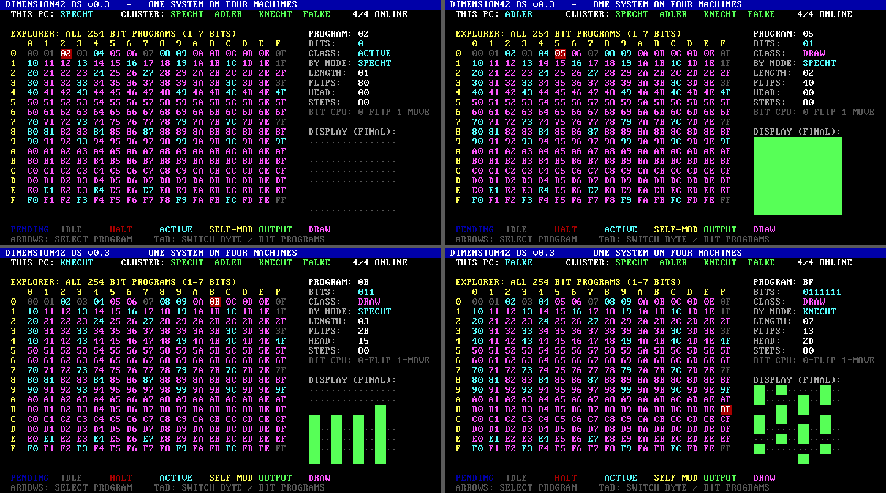

# Dimension42 OS

This is the original v0.3 OS documentation. Its roadmap describes that OS version;
the host-side explorer has since completed the five-byte map. See the [current project overview](../README.md).

An operating system for the cluster **SPECHT · ADLER · KNECHT · FALKE**, written directly in
x86 machine code. There is no assembler or compiler. Every byte of the OS is written by hand
in `src/*.hex`.


## Run it

```bash
powershell -ExecutionPolicy Bypass -File run-cluster.ps1
```

This builds the image and opens 4 QEMU windows (one per PC) connected by a virtual ethernet hub.
Click a window and use the **arrow keys** to explore programs.

Build only: `python tools/build.py` → `build/dimension42.img` (bootable 1 MiB disk image).

## What it does (v0.3)

1. **Cluster**: every PC boots the same image, reads its MAC address to find out which node
   it is (last MAC byte 1-4 = SPECHT, ADLER, KNECHT, FALKE) and broadcasts a heartbeat every second.
   A node shows as ONLINE if it was heard within the last 3 seconds.
2. **Program explorer**: runs *every* possible 1-byte program (256) on **NANO**, a tiny
   simulated CPU inside the kernel, and classifies what each one does.
   The work is split over the cluster: SPECHT 00-3F, ADLER 40-7F, KNECHT 80-BF, FALKE C0-FF.
   Results are shared over ethernet, so every node shows the complete map.
   Without a network card, one PC runs all 256 itself.
3. **Viewer**: a 16×16 map coloured by behaviour. The side panel shows the selected program's
   instruction, class, the node that computed it, A, outputs, memory and the 8×8 display.

### v0.3: bit programs (press TAB)



**BIT CPU**: every instruction is one bit. `0` flips the pixel under the head, and `1` moves the head one pixel
right. The 8×8 display is a 64-pixel strip read row by row. A program repeats for 128 steps.
There are only **2 one-bit programs** (`0` and `1`), so the explorer covers every program from 1 to 7 bits:
2+4+…+128 = **254 programs**. Grid cell = `1` followed by the program bits, so `02` = `0`, `03` = `1`,
`05` = `01`, `FF` = `1111111`. The work is split across the cluster like the byte programs.

- `1`: only moves, never draws (IDLE)
- `0`: one pixel blinking 128 times, so it ends dark (ACTIVE)
- `01`: fills the screen. `011`: vertical stripes that wrap around and partly erase themselves
- Result: 207 DRAW, 40 ACTIVE, 7 IDLE

Verified: both result tables were dumped from a running node's memory and compared against an independent
Python model. All 512 records match.

### NANO CPU

16 bytes of memory (M0-MF), register A. The program is loaded at M0, and the PC wraps at program length,
so a 1-byte program runs its instruction again on every step for 64 steps. M8-MF is an 8×8 pixel display.
Programs can overwrite themselves.

| op | name | effect | op | name | effect |
|----|------|--------|----|------|--------|
| 0n | NOP  | -            | 8n | JZ   | if A=0: PC=n |
| 1n | LDI  | A = n        | 9n | INC  | M[n]++ |
| 2n | ADDI | A += n       | An | DEC  | M[n]-- |
| 3n | SUBI | A -= n       | Bn | ROL  | A rotate left n |
| 4n | LD   | A = M[n]     | Cn | XOR  | A ^= M[n] |
| 5n | ST   | M[n] = A     | Dn | OUT  | output M[n] |
| 6n | ADD  | A += M[n]    | En | NOT  | M[n] = ~M[n] |
| 7n | JMP  | PC = n       | Fn | HLT  | stop |

Classes: **DRAW** (lit the display) > **OUTPUT** > **SELF-MOD** (changed its own byte) >
**ACTIVE** (A or memory changed at some step) > **HALT** > **IDLE**. PENDING means the node that owns that
program hasn't sent its result yet.

Some discoveries:
- `D0` is a quine: it prints its own byte.
- `50` deletes itself.
- `A0` turns itself into `9F` and starts counting on the bottom display row.
- `E8` blinks the top display row.
- `60` and `C0` look idle at the end but were busy in between. Because of this, classification uses everything
  that happened during all 64 steps, not just the final state.

## Files

| file | what |
|------|------|
| `src/boot.hex`   | boot sector (512 bytes): loads the kernel with BIOS LBA read |
| `src/kernel.hex` | kernel: cluster networking, NANO CPU, explorer, viewer |
| `tools/build.py` | turns hex into the disk image and checks every `=XXXX` offset marker |
| `tools/disasm.py`| decodes the image back to instructions to verify the hand-written bytes |
| `tools/switch.py`| virtual ethernet hub for the QEMU test cluster (not part of the OS) |

Hex format: `XX XX ; comment`. `=XXXX` asserts the current offset. `>XXXX` pads with zeros up to that offset.

## Real hardware: not yet

Tested only in QEMU so far. Read from the real nodes over SSH (2026-10-06):

| node | network chip in use | PCI ID | MAC | firmware |
|------|-------------------|--------|-----|----------|
| specht32 | Intel I219-V | 8086:15b8 | 4c:ed:fb:94:98:f9 | UEFI, Secure Boot off |
| adler40  | Intel I226-V | 8086:125c | 04:7c:16:83:97:d4 | UEFI, Secure Boot off |
| knecht24 | Realtek RTL8125 2.5G (+ unused Intel I211 8086:1539) | 10ec:8125 | 70:85:c2:b3:80:43 | UEFI, Secure Boot off |
| falke64  | Intel I226-V | 8086:125c | 60:cf:84:ea:9a:fa | UEFI, Secure Boot off |

Still missing for real hardware:
- drivers for I226 (2 nodes), I219 and RTL8125. The OS currently only has RTL8139.
- a UEFI loader (an `.efi` file, also written in hex). The machines boot UEFI, and the BIOS boot sector may not start.
- a table mapping the MACs above to node names. The current "last MAC byte = id" only works in QEMU.
- **These four PCs are the live, shared GPU cluster** (see `C:\Users\end\dev\cluster`). Booting Dimension42 on one
  (even from USB, without touching the disk) takes its LLM services offline for everyone. Only do it with
  explicit approval and coordinated with jamie.

## Roadmap

- v0.3: explore 2-byte programs (65,536) split over the cluster; turn found programs into reusable building blocks
- v0.4: protected/long mode, more memory, faster
- v0.5: shared memory and task scheduling across the 4 nodes, so they act as one system
